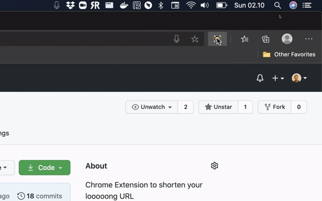

# ngecilin

Chrome Extension to shorten your looooong URL

## Getting started

- Install dependencies

		yarn

- Create `manifest.key` see [manifest docs](https://developer.chrome.com/extensions/manifest/key) used to development mode. We've setup a simplified way to do that by using the following command *sequentially*:

		yarn gen:cert # generate the certificate
		yarn gen:key # generate the key itself
		yarn gen:id # get the actual chrome id

  You can learn more about the key generation in this [StackOverflow answer](https://stackoverflow.com/questions/37317779/making-a-unique-extension-id-and-key-for-chrome-extension).

- First, copy `manifest.key.example` to `key/manifest.key`, to do that you can simply do the following

		yarn dev:setup

- Get your key and paste to `key/manifest.key`

- You can build the chrome extension using the following command, and the build will appear in `dist` folder.

		yarn build

- And then you can register your extension by opening extension url/setting in your Browser.
  - Edge: `edge://extensions`
  - Chrome: `chrome://extensions`

  Then you can set your extension setting to developer mode and load unpacked extension from our `dist` directory.

# Installation  

